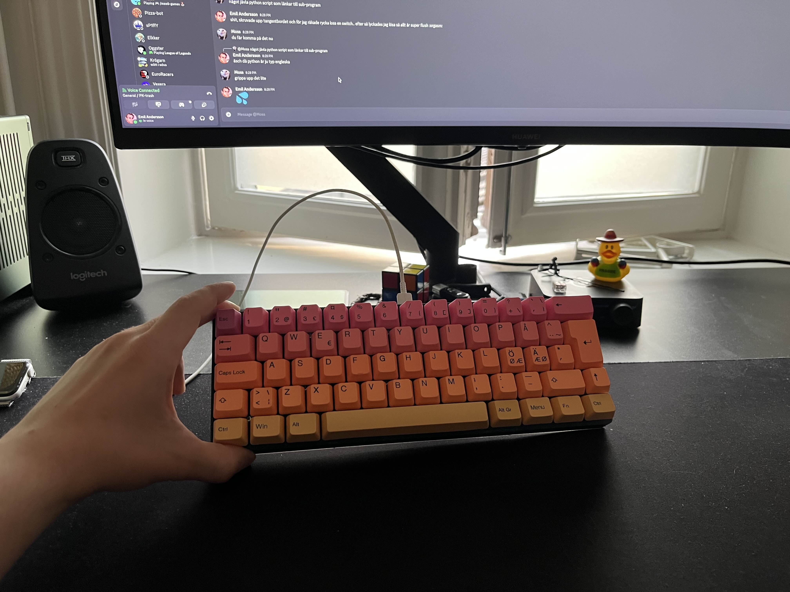

# EKB60

My very first custom keyboad.

## Background

I wanted a new keyboard, a smaller keyboard than I already had. Unfortunetly my old keyboard worked perfectly fine, the formfactor and how uncustomizable it was started to annoy me.
Since I got myself a 3D-printer a few months prior to this that had been used less than I orginally thought (chocking).
I've been wanting a project simple enough that I can CAD my own model and get to create my own product from scratch.
(Also soldering has always intruiged me but never got around to it)

So all of this combined lead me to the thought, how hard can it really be to create my own keyboard.
With my birthday around the corner I wanted to do something for myself, I decided to give it a try and orderd a bunch of parts, soldering iron etc. etc.

## Layout

I wanted a smaller keyboard and was intrested trying out having layers, opted to a 60% ISO/Nordic layout. Using (https://www.keyboard-layout-editor.com/).
Saved in layout.json.

## CAD

I'd not used CAD-software since highschool. Since I been daily driving linux for the past 2 years, the most commons CAD software was out the window (Autodesk fusion, Solidworks) left was FreeCAD that I started to get a taste of. Whilst iterating through my design I felt as I was getting better and understading how it works and getting quite efficent at this still quite basic design.

Closing in to the end of the project I stumbled upon OpenSCAD, and thought it looked promising. But decided to stay to FreeCAD and finish the project, with using OpenSCAD in my upcoming designs/projects.

## Wiring

Quite simply took the layout, pasted it into (https://kbfirmware.com/) and used the wiring schema it suggested.

## Hardware

Out of cheapness and most availble devboards out there, I got a few RaspberryPi Pico.

## Firmware

At first I was looking at QMK, the most used and trusted firmware for keyboards. Although it seemd like the rp2040 had some special documentaion site with a few extra things to keep in mind.
Then I noticed that KMK a keyboardfirmware written in CircitPython was available, since the rp2040 ran it like a charm, it was easy to configure - it was the way to go.

And no regrets so far, works like a charm!

## Conclusion

An fantasic project I really recommend others who is thinking about it do. If you've already started thinking about 3D printing, soldering, and writing your own firmware - its probably just waiting to happend, and you wont regret it!